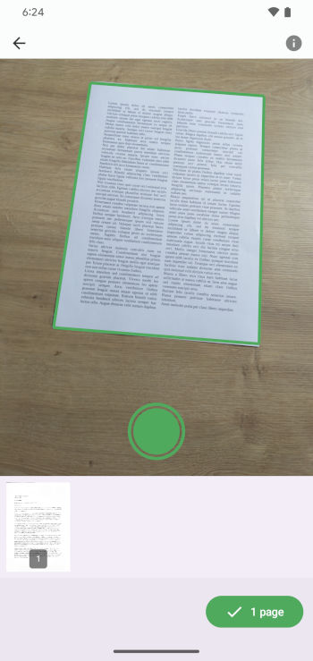
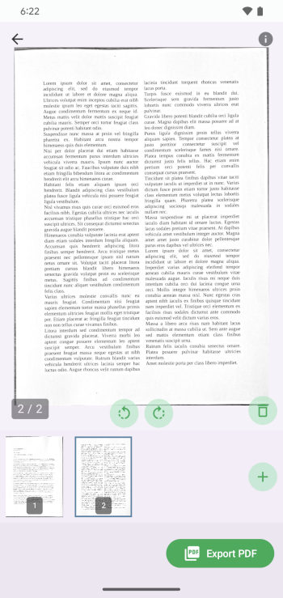
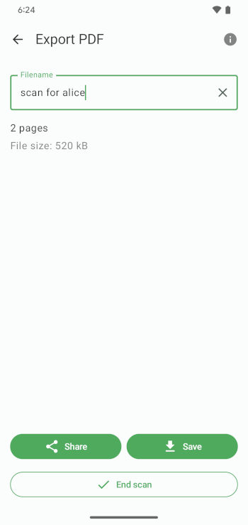

# FairScan

FairScan is an Android app to scan documents. It aims to be simple and respectful to users.

"Simple" means that users should get a clean PDF in seconds and without thinking:
- The user interface should be super clear, with no distractions.
- The scanning process should be obvious.
- The app should automatically handle all image processing and PDF generation tasks.

## Get FairScan
- [Google Play](https://play.google.com/store/apps/details?id=org.fairscan.app)
- [GitHub releases](https://github.com/pynicolas/FairScan/releases)

See also the website: [fairscan.org](https://fairscan.org)

## Screenshots
| 1. Scan                                           | 2. Preview                                        | 3. Save & Share                                   |
|---------------------------------------------------|---------------------------------------------------|---------------------------------------------------|
|  |  |  |

## Features

- Automatic document detection (using a custom image segmentation model)
- Automatic perspective correction
- Automatic image enhancement

## Compatibility

FairScan should be compatible with all devices that:
- run Android 8.0 or a more recent version
- have a camera

## Privacy

- All data stays on the device. As of today, FairScan does not access the internet.
- Minimal permissions:
  - Camera
  - WRITE_EXTERNAL_STORAGE: only on Android 8 and 9 to save generated PDFs in the Download directory.
- Zero trackers.

## Main dependencies

- [Jetpack Compose](https://developer.android.com/compose) for the user interface
- [CameraX](https://developer.android.com/media/camera/camerax) to capture images from the camera
- [LiteRT](https://ai.google.dev/edge/litert) to run the segmentation model for automatic document detection
- [OpenCV](https://opencv.org/) for:
  - perspective correction
  - image enhancement
- [PDFBox-Android](https://github.com/TomRoush/PdfBox-Android) for PDF generation

Kudos to the developers of those projects!

## Build instructions

To build an APK:
```bash
./gradlew clean check assembleRelease
```

To build an Android App Bundle:
```bash
./gradlew clean check :app:bundleRelease
```

## License
This project is licensed under the GNU GPLv3. See [LICENSE](LICENSE) for details.
